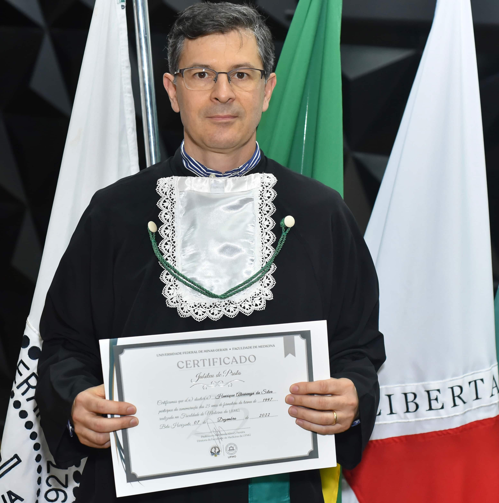
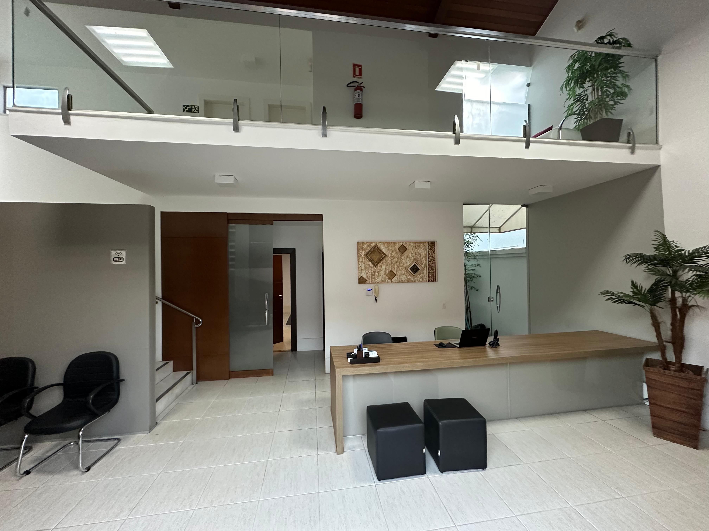
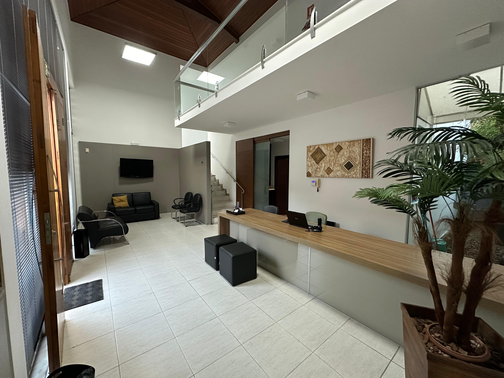

::: {.hero-banner}

::: {.hero-text}
# Dr. Henrique Alvarenga da Silva

::: {.lead}
Médico Psiquiatra · Professor de Medicina (UFSJ e UNIPTAN)
:::

::: {.credenciais}
Membro da Associação Brasileira de Psiquiatria (ABP)
CRM-MG 31.778 · RQE 8381 (psiquiatra)
:::
:::
:::

## <i class="bi bi-person-circle"></i> Quem sou

Sou Médico Psiquiatra, graduado em Medicina pela **Universidade Federal de Minas Gerais (UFMG)** em 1997 e especialista em Psiquiatria pelo **Hospital das Clínicas da UFMG** (2000). Também sou especialista em **Psicoterapia Cognitiva-Construtivista** pelo Núcleo de Psicoterapia Cognitiva de São Paulo.

Além da medicina, graduei-me **Bacharel em Direito** pelo UNIPTAN (2013), mas minha profissão continua sendo a medicina — em especial a psiquiatria.

Fiz meu **mestrado em Ensino em Saúde** pela UNIFENAS (2018) e atualmente leciono no Curso de Medicina do **UNIPTAN** (Métodos de Ensino e Pesquisa) e no Curso de Medicina da **UFSJ** (Psiquiatria e Psicopatologia).

Há mais de **25 anos** atendo em consultório particular em São João del-Rei.

## <i class="bi bi-award"></i> Jubileu de prata

{.img-fluid fig-align="center" width="70%"}

Em dezembro de 2022 tive a honra de receber, junto com meus colegas da UFMG, o diploma de **25 anos de carreira médica**.

> Obrigado a Deus, à minha família e aos meus pacientes que trilharam comigo esses 25 anos.

## <i class="bi bi-geo-alt"></i> Consultório

::: {.gallery}

:::

::: {.info-grid}
::: {.info-card}
**Endereço**
Rua Aureliano Mourão, 140 — Centro
São João del-Rei – MG
:::

::: {.info-card}
**Telefones**
(32) 99981-2366 (WhatsApp)
(32) 3371-7176 (fixo)
:::

::: {.info-card}
**Email**
[henriquealvarenga@gmail.com](mailto:henriquealvarenga@gmail.com)
:::
:::

::: {.map-wrap}
<iframe src="https://www.google.com/maps/embed?pb=!1m18!1m12!1m3!1d351.51675751723417!2d-44.26102396929085!3d-21.137862602141738!2m3!1f0!2f0!3f0!3m2!1i1024!2i768!4f13.1!3m3!1m2!1s0xa1c8914dd8a263%3A0x4aa62d14c84dc31f!2sRua%20Aureliano%20Mour%C3%A3o%2C%20140%20-%20Centro%2C%20S%C3%A3o%20Jo%C3%A3o%20del%20Rei%20-%20MG%2C%2036307-334!5e0!3m2!1sen!2sbr!4v1711745260490!5m2!1sen!2sbr" allowfullscreen loading="lazy" referrerpolicy="no-referrer-when-downgrade"></iframe>
:::

::: {.social-buttons}
[Lattes](http://lattes.cnpq.br/6147640440978297)
[Instagram](https://www.instagram.com/henriquealvarengadasilva)
[LinkedIn](https://www.linkedin.com/in/henriquealvarengasilva)
:::
